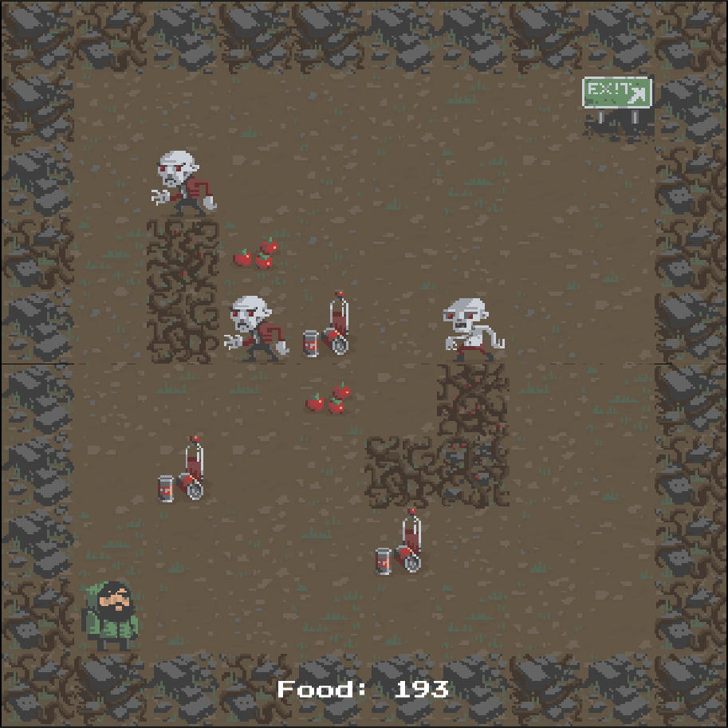
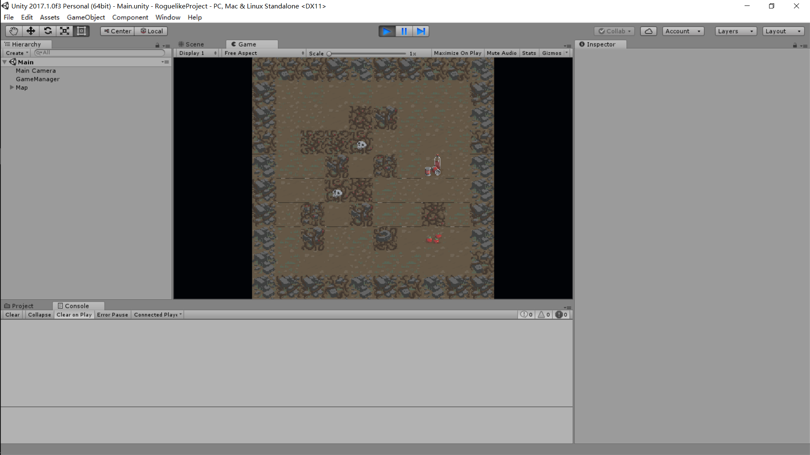

# 2017-7-31 Unity学习第一周

现在学起来，还没有超出我学习的范围。就是熟悉程序界面，怎么导入素材，以及如何一些对象的属性的更改之类的。毫无难度，没有任何挑战。

自从开始学习GOLang，各种问题不断。后悔学习这个东西了。不如之前学习python来的带劲。也可能是因为这段同时学习的东西太多了。各种各样的知识一直在冲突，最后一个月好好收心，将重点放在Unity上。

说好两个月做游戏的，结果现在唯一的收获就是从Linux跑到Windows。虽然windows总体反应没有linux迅速，但好处是省电以及美观，不折腾。（虽然这几天win折腾的不比linux少，而且没有linux方便、直接。）

不过也算了。现在win有了linux子系统，在这个东西的帮助下，windows也不是那么别扭了，既然win可以如此方便的使用linux，那么也没必要在linux放个虚拟机，消耗过多的性能。

linux最强的东西，不就是它的终端吗？有了终端，还要什么GUI?

从今天开始，熟悉使用Unity。开发（照抄）一款2D平台游戏。


## 2017-8-01 

### 如何控制一个对象

给对象建立一个脚本。

在脚本里新建一个FixedUpdate()函数，有以下东西

```c#
var moveHorizontal = Input.GetAxis("Horizontal");
var moveVertical = Input.GetAxis("Vertical");
```

在这里,这两个是获取键盘控制，以及触控屏控制。

但是，接下来的一个点有一些不明白。

```c#
Vector3 movement = new Vector3(moveHorizontal,0.0f,moveVertical);
```

如果前两句是获得键盘输入，那么，这个按理说就是控制移动。可是，接下来还有那么一句话。

```c#
GetComponent<Rigidbody>().AddForce(movement*speed*Time.deltaTime);
```

这句代码就是获取刚体这个元素，也就是我们控制的小球。同时，$AddForce$，给它一个力，这个力的大小，就是我们控制的方向及速度及每秒移动的距离。

简单的整理一下上面的几句话。就是，先获取键盘输入，接着，给键盘输入下一个定义：让它控制物体的x,y,z，因为我们只输入x,z所以，y的值设为0.0f(float)。到这里，我们并未实现物体移动。前面的目的只是为了定义如何改变。真正实现移动的，是最后一句话。缩地刚体，同时，实现每秒移动的距离。前面的几句，都没有真正锁定刚体，而只是在下定义罢了。

完整代码为：

```c#
using System.Collections;
using System.Collections.Generic;
using UnityEngine;

pubilc class PlayerControler : MonoBehaviour {
  public float speed;
  
  void Start(){}
  
  void FixedUpdate(){
    float moveHorizontal = Input.GetAxis("Horizontal");
    float moveVertical = Input.GetAxis("Vertical");
    
    Vector3 movement = new Vector3(moveHorizontal,0.0f,moveVertical);
    
    GetComponent<Rigidbody>().AddForce(movement*speed*Time.deltaTime);
  }
}
```


### 如何控制摄像机

在里，我们希望摄像机锁定小球，跟随小球运动。如果简单的将摄像机和小球绑定，让摄像机成为小球的子对象。那么摄像机就会跟着小球转动。

在start()函数里，首先记录下摄像机的位置。这里只执行一次，目的就是获知当前摄像机在哪里。

之后新建函数LateUpdate()，在这里，我们要做一件事，就是让摄像机的位置在最开始的位置的基础上跟着某件东西移动。$摄像机的位置=最初的位置+跟着某件物体的位置变动$。

因为在这里，我们仅对摄像机做脚本，在这个脚本里，我们并不知道外界有什么东西，更不知道我们要随着什么一起运动。所以我们要在代码的最开始，空出一个变量，之后我们再在引擎里将小球填进这个变量里。

那么代码可以这样写。

```c#
public GameObject player;
private Vector3 offset;
```

第一句空出一个变量。第二句空出一个方位变量。

---

```c#
void Start(){
  offset = transform.position;
}
```

在Start函数里，我们将方位变量填上摄像机的位置。

---

```c#
void LateUpdate(){
  transform.position = player.transform.position + offset;
}
```

在这里，摄像机的位置跟随某个物体的位置移动。

到这里为止，我们的摄像机就会跟着某个东西一起移动了。

回到引擎上，我们会发现，摄像机的属性里，空出了一个叫player的小框。这就是我们之前申明的GameObject,变量，拖动小球到这个变量里，我们就实现了摄像机跟着小球运动的目的了。


### 碰撞物体，让其消失

我们在游戏里，经常会有捡到物品或者金币那么一种行为。但是，我们现在做到这里，游戏对象与游戏对象接触后，只是简单的碰撞，对方并没有消失。那么，如何实现捡金币的效果呢？

在这里，我们依旧是用小球来做说明。

我们可以先给可以捡拾的物品做一个标记，比如"PickUp"，把它添加到这个物体的TAG中。

这里，我们需要在小球上设立脚本。事实上，我们也可以为物体设立脚本，但我们要捡拾的东西往往多余我们的角色，在角色上设立一个脚本，比在众多物品上设立脚本方便得多。

在小球的脚本里，添加一个函数。这个函数属于Unity的api。

```c#
void OnTriggerEnter(Collider other){
  if (other.gameObject.tag == "PickUp"){
    other.gameObject.SetActive(false);
  }
}
```

这里也出现了一个gameObject ，和上文里，我们用的GameObject很像，但是，一个是某个物体的属性，一个是对象。

我们希望当某个东西的tag等于PickUp时，这个物体的显示就设置为false。

这里并没有结束，回到引擎里，我们还要在物品设置碰撞触发器。否则我们引擎只是理解我们相碰，没有设置触发机制。


### 显示分数

在引擎的游戏画面里，新增一个UI，属性是Text。

因为这个变化和小球的碰撞有关，所以我们在小球的脚本里添加一些东西。

在最开头，我们要将这个脚本和UI的显示相关联。于是，

```c#
using UnityEngine.UI;
```

这样，这个脚本里，我们就可以对UI产生影响。但这里，我们只是希望产生影响，还没有真正关联上具体的UI对象。为此，我们槽开一个空白，以此容纳一个UI text对象。

```c#
public Text countText;
```

---

```c#
private int count;
```

我们增加一个Int属性的变量，用来容纳分数。这里之所以用private,是希望我们不能在引擎里改变这个count的数值大小

---

这个Text对象要显示什么呢？为此，我们再建立一个函数。

```c#
void setCountText(){
  countText.text = "Count: "+count;
}
```

我们将countText这个对象的text内容，改变为"Count: "+count。

---

最最开始，我们在start()函数里，将count归0，并且调用setCountText()函数，显示文字。

在碰撞物体的基础上，希望每次碰撞后，都会增加一个数字。

那么在OnTriggerEnter函数里，在other.gameObject.SetActive(false);下添加一句代码。

```
count++;
```


到这里，我们就实现了显示分数的能力了。

.png)


## 2017-8-02

### 如何创建人物动画

在导入游戏人物素材之后，可以将人物行为的几个动画同时选中，拖动到对象栏当中，就可以创建三个东西：

1. 人物对象
2. 人物的动画IDLE（.anime）
3. 人物动画控制器

解释一下这三个东西。1、人物对象，就是一个对象。2、人物IDLE，人物普通状态下的行为。3、动画控制器，控制人物动作。

在动画这个对象的属性里，有一个Animetor，双击旗下的Controller，可以打开人物状态机，在这里可以设置动画的状态。

### 如何设定人物动作

在上一节的基础上，将人物动画直接拖动到人物对象上，就可以创建人物状态，或者说，人物的动作IDLE。此时我们只是简单的将动画归类，并没有设定人物与动作的互动。

### 人物对象复写

如果只是建立一两个人物动画还好说，但是如果我们要创建几个人物，虽然有着不同的外表，但是他们的动作都是相同的。比如，穿着军服和日常衣服的人物都有走，吃，攻击，防御几个相同的状态。在这种情况下，我们可以继承人物对象的状态，但是替换掉动画。

新建一个Animetor Override Controller文件，之后将我们先前制作的人物控制器拖动到它的属性上，就完成了人物状态的继承。之后再重新将动画文件覆盖在动作上即可。


以上就是简单的人物动画创建。


## 2017-8-03

### 创建随机地图框架

随机地图的创建在于如何创建随机的地面图块。

为此，创建一个新的GameObject[]数组，用以存放多个地图块。之后只要规划一下放置的位置就对了。简单的演示一下，在2d的地图上，如何绘制一个外围墙及地面。



首先是外围墙。

```c#
public GameObject[] outWallArray;
public int rows=10;
public int cols=10;
private Transform mapHolder;
mapHolder = new GameObject("Map").transform;
private void mapFrame(){
	for (int x=0;x<rows;x++){
	  for (int y=0;y<cols;y++){
	    if (x==0||x==rows-1||y==0||y==cols-1){
	      int index = Random.Range(0,outWallArray.Length);
	      GameObject map = Instantiate(outWallArray[index],new 																	Vector2(x,y),Quaternion.identity);
	      map.transform.SetParent(mapHolder);
	    }
	  }
	}
}
```

> 第一句，建立一个存放外边围墙的数组。
>
> 第二、三句，规定一下地图的大小，长10，宽10。
>
> 第四、五句暂时放下，等下再一起讲。
>
> 第六句，建立一个名字叫mapFrame()的函数，这个函数的目的就是建立一个大体的地图框架。
>
> 第七、八句，两个for循环，在这个10X10的地图上绘制地图。
>
> 在看看if句。if的条件，表面我们要在第一列、第一行、最后一列、最后一行的地方画图。画什么呢？
>
> if下第一句，申明一个index的数字，这个数字从0到存放外围墙的数组的最大值中，取一个整数。
>
> 之后if下第二局，我们让从外围墙数组中取出一个图块，让它显示在（x,y）这个地方，Quaternion.identity意思是不旋转。
>
> 最后一句，和第四、五句，一起，建立一个叫Map的父对象，将所有创造出来的地图块都加入到这个父对象中。

到这里为止，只是简单的创造了外围墙，还没有地面。

为了绘制地面，要对上面的代码做一点改造。为了好看，将部分代码省略。

```c#
public GameObject[] outWallArray;
public GameObject[] floorArray; //新增的部分
.....
if(x==0||x==rows-1||y==0||y==cols-1){
  ......
}else {
  int index = Random.Range(0,floorArray.Length);
  GameObject map = Instantiate(floorArray[index],new Vector(x,y),Quaternion.identity);
  map.transfrom.SetParent(mapHolder);
}
```

> 新增的数组，用来装地面的图片。之后新增的else部分，和绘制围墙同理。

这里结束以后，就能绘制一个大体的地图框架了。


### 随机创建地图上的障碍

这里最重要的是障碍的随机性。在绘制地图框架的时候，只需要简单的设定界限，比如在第几行、第几行绘制外围墙，其他的绘制地面，就好了。但在这一步，需要做到随机性就不能用上面的方法了。

因此，需要先制作一个列表，不要数组的原因是，列表比数组更方便加入元素和删除元素。在这个列表里，我们装入的是我们需要随机放入障碍领域的地图位置。每次随机抽出一个地图位置，在这个地图位置放入一个随机障碍，接着从列表里删去这个地图位置，避免出现两个障碍出现再同一个位置。

看一下实例代码，创建一个存放地图位置的列表。

```c#
private List<Vector2> positionList = new List<Vector2>();
private void makeHinder() {
  positionList.Clear();
  for (int x=2;x<rows-2;x++){
    for(int y=2;y<cols-2;y++){
      positionList.Add(new Vector2(x,y));
    }
  }
}
```

> 第一句，建立一个二维向量的列表，名字叫做positionList。
>
> 第二句，建立一个名字叫makeHinder()的函数，表面在这个函数里，我们准备布置障碍。
>
> 第三句，我们清空positionList这个列表。
>
> 第四、五句，两个for循环，获取2，到最大长度减2的地图位置。之所以是这个范围，是因为我们要至少留一条小路，保证玩家无论如何都能到达终点。
>
> 第六句，将该范围的所有地图位置加入到positionList这个列表。

这一步，我们只是创造了地图数据列表，并没有加入障碍。为此我们再新建一个函数，用来布置障碍。

```c#
public int mixHinder;
public int maxHinder;
public GameObject[] hinderArray;
private void decorateHinder(int mix,int max,GameObject[] array){
  int count = Random.Range(mix,max+1);
  for (int i=0;i<count;i++){
    int positionIndex = Random.Range(0,positionList.Count);
    
   	int arrayIndex = Random.Range(0,array.Length);
   	GameObjec map = Instantiate(array[arrayIndex],positionList[positionIndex],Quaternion.identity);
 	map.transform.SetParent(mapHolder);
    
    positionList.RemoveAt(positionIndex);
 	}
}
```

> 前三句，建立了我们需要布置的障碍的最大值，最小值以及存放障碍对象的数组。
>
> 函数体里的第一句，我们随机从最小值到最大值里抽一个数，这个数就是我们要布置障碍的数量。
>
> for循环里第一句，随机从地图位置列表的总数里，抽一个地图位置号数，存放到positionIndex。
>
> 再往下一句，我们随机从障碍对象数的最大值抽出一个数,存放到arrayIndex。
>
> 再下一句，再array[arraryIndex]这个对象，放到positionList(positionIndex)这个位置，不旋转。
>
> 倒数第二句，将这个对象，加入到mapHolder这个父对象中。
>
> 最后一句，我们从位置列表里删去这个已经布置了障碍的位置。

现在我们只要在makeHinder这个函数的末尾，调用这个decorateHinder函数，就可以实现随机布置障碍的目的了。

食物的布置同理。

最后，在引擎上，将食物、障碍分到同一层就可以了。

最后结果是这个样子。




## 2017-8-05

### 角色的控制

之前有一部分是关于Vector3的移动案例，但是Vector2的案例还没有。虽然两者没多大区别，但还是好好整理一下为好。

先在引擎里，给对象加入刚体。因为现在制作的是2d游戏，所以选用2d的刚体(ridigbody2d)

对我们需要控制的对象上，建立一个新的脚本。

脚本里，用FixedUpdate()函数替代Update()，也可不替代，只是个人觉得这样动画会好看一些。

先说明一下，我们的目的。这次游戏里，需要做到这么一个效果。**每走一步，角色就停止一下。**

简单的说说逻辑。最开始，我们要接收从键盘上输入的案件，得到一个位置，这个位置等于目前我们的位置，加上我们键盘输入后得到的位置。之后我们让角色移动。但是刚体存在惯性，因此，需要隔断时间暂停一次，用return返回。

好了，先实现第一步。

```c#
float h = Input.GetAxisRaw("Horizontal");
float v = Input.GetAxisRaw("Vertical");
targetPos += new Vector2(h,v);
```

接着，来看看第二部，让角色开始移动。

```c#
GetComponent<Rigidbody2D>().MovePosition(Vertor2.Lerp(transform.position,targetPos,smoothing*Time.deltaTime));
```

第三步，实现步伐间隔。

```c#
public float restTime = 0.5f;
public float restTimer = 0;
...
restTimer += Time.deltaTime;
if(restTimer<restTime){
  return;
}else {
  ...
}
```

到现在，我们已经懂得如何实现这个步骤了，关键是如何组合这些步骤。

首先要明白，在FixedUpdate()函数体里，每隔段时间都会暂停一会儿。

如果是以上面的顺序来看，会发现，最后一步压根没作用。因为到达return之前，已经不停的运动，哪怕到达了return，我们也会重新刷新，一直在不停的运动。为此，我们让让第三步往前靠。

再看看第二步。第二步控制的是运动，如果太往后靠，它会随着步伐间隔而停止，然后又往前，又停，又往前。看上去就像掉帧一样。

于是，我们要让输入靠后。

最后，看上去，代码就是这样子的。

```c#
private void FixedUpdate(){
  GetComponent<Ridigbody2D>().MovePosition(Vector2.Lerp(transform.position,targetPos,smoothing*deltaTime));
  restTime += Time.deltaTime;
  if(restTimer<restTime){
    return;
  }else {
   float h = Input.GetAxisRaw("Horizontal");
   float v = Input.GetAxisRaw("Vertical");
   targetPos += new Vector2(h,v);
   restTimer = 0;
  }
}
```


## 2017-8-06

### 物体碰撞

再此前，我们用引擎造出的刚体实现了碰撞。但是，当时并不了解过多细节。这次，将细细看一下，如何实现物理碰撞。

给角色和墙体之类的物体加入碰撞机（BOX Collider 2d），之后，对象就会被四条线围住。这四条线围成的方框，类比成一个盒子一样的东西，一旦盒子与盒子接触，则视为发生碰撞。避免两个盒子只是靠在一起就发生碰撞，调小盒子的大小。

除此以外，还需要对我们需要发出碰撞的物体加入一点标签。

之后，先对角色的脚本进行更改。

在行动前，加入一些脚本。

```c#
GetComponent<BoxCollider2D>().enable = false;
RaycastHit2D hit = Physics2D.Linecast(targetPos,targetPos+new Vector2(h,v));
GetComponent<BoxCollider2D>().enable = true;
```

hit发出的射线，检测的是前方是否有盒子的边。可发出射线的物体本身，也是一个盒子。所以要先将自己的盒子关闭，再发出射线，这样就能检测到前方的物体了。

```c#
if(hit.transform==num){
  ...
}else if (hit.collider.tag == "Wall"){
  ...
}else if (hit.collider.tag == "OutWall"){
  ...
}
```

如果不能前进，...换成return;就可以了。

### 触发动作

我们希望，当碰撞到标签为"Wall"的时候，发起某个动作、行为。

在这里，使用这两个api。

```c#
GetComponent<Animator>().SetTrigger("doSomething");
```

这里的doSomething，是之前在状态机里设置的Trigger。

举个例子。

```c#
if(hit.collider.tag == "Wall"){
  GetComponent<Animator>().SetTringger("Attack");
}
```

当检测到前方有墙的时候，就会触发攻击的动作。

另外，我们还可以调用方法。

```c#
hit.collider.SendMessage("Method");
```

这个是配合上文的碰撞检测一起使用。这个api是发送信号，告诉引擎执行Method这个函数。


## 2017-8-08

### 敌人如何追踪角色

大体思路就是，判断自己和角色的具体位置差。如果y轴相差得大，就往y轴走，反之，往x轴走。

放一下简单的实例代码。新建一个Enemy.cs

```c#
private Vector2 targetPos;
private transform player;
...
void Start(){
  targetPos = transform.position;
}
void PreMove(){
  Vector2 offset = player.position - transform.position;
  if(Mathf.Abs(offset.y)>Mathf.Abs(offset.x)){
    if(offset.y>0){
      ...
    }else if(offset.y<0){
      ...
    }
  }else{
    ...
  }
}
```

